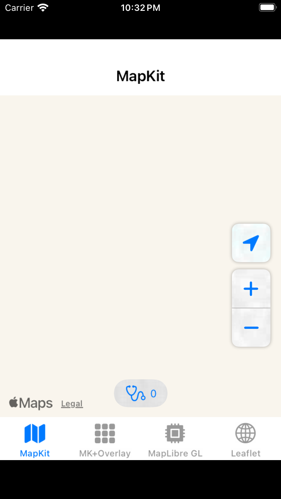
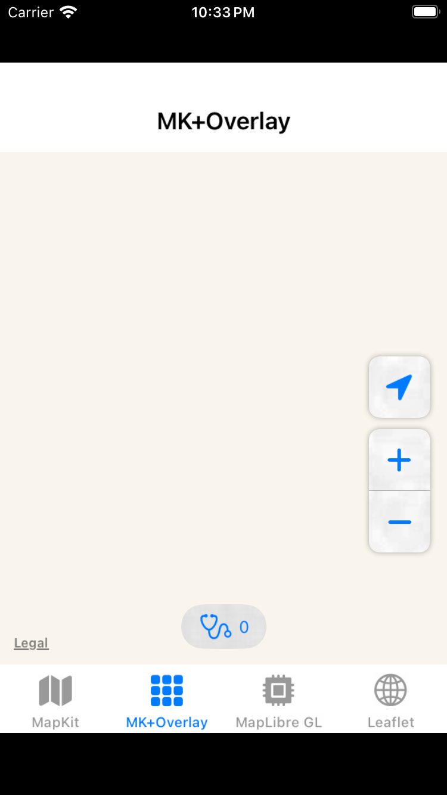
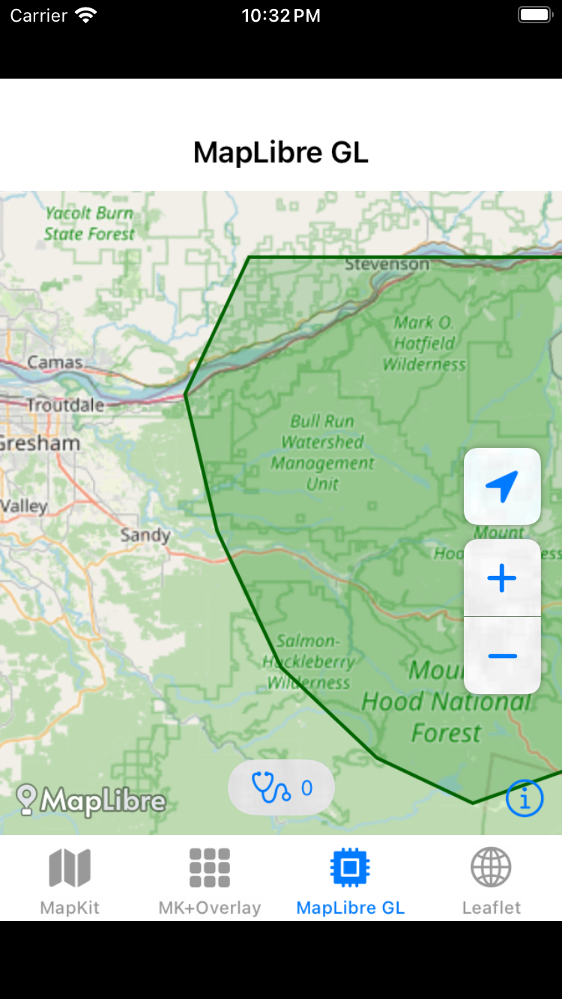
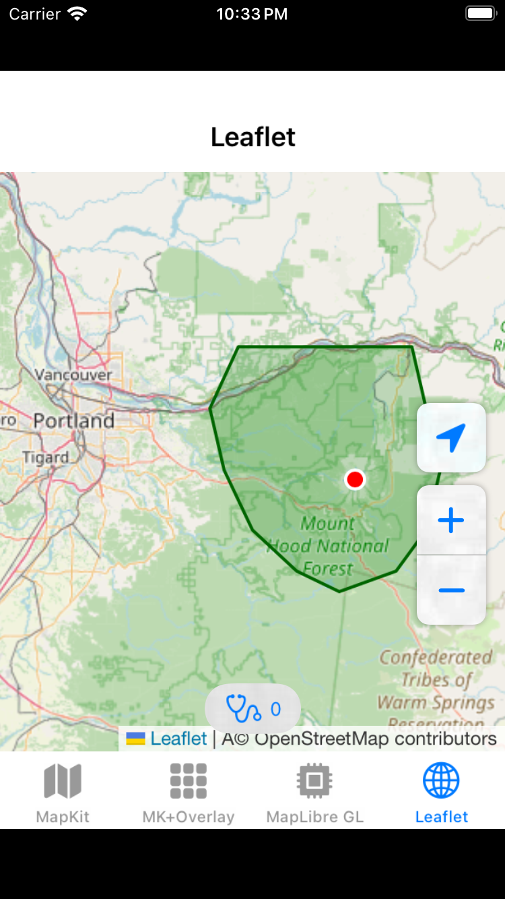

# iOSMapsTest

Test harness comparing 4 map rendering backends in a QEMU iOS Simulator where Metal GPU is unavailable.

## Why

macOS VMs running under QEMU/KVM (Docker-OSX, UTM, etc.) lack Metal GPU support. This makes Apple's MapKit unusable — `MKMapView` renders as a blank beige rectangle. This project tests which map SDKs still work in that environment.

## Results

| Backend | Renders in QEMU? | Renderer | Notes |
|---------|:-:|----------|-------|
| MapKit | No | Metal (required) | Blank — Metal unavailable |
| MapKit + MKTileOverlay | No | Metal (required) | Blank — MKMapView broken regardless of tile source |
| **MapLibre GL** | **Yes** | OpenGL ES 3.0 | Built from source with OpenGL renderer |
| **Leaflet.js** | **Yes** | Software (WebKit) | WKWebView, no GPU dependency |

All backends include a Mt. Hood National Forest polygon overlay and summit marker for feature comparison.

## Screenshots

| MapKit (blank) | MK+Overlay (blank) | MapLibre GL | Leaflet.js |
|:-:|:-:|:-:|:-:|
|  |  |  |  |

## Key Findings

1. **MKMapView requires Metal** — no workaround, not even custom tile overlays help
2. **MapLibre GL works via OpenGL ES 3.0** — Apple's software OpenGL renderer is available in the QEMU simulator. MapLibre must be built from source with the `drawable` (OpenGL) renderer instead of the default Metal renderer
3. **Leaflet.js via WKWebView works** — WebKit uses software rendering internally. Good for simple tile display but limited compared to native SDKs
4. **OpenGL ES 3.0 is available** in the QEMU iOS Simulator despite no GPU

## Setup

### Prerequisites

- macOS VM with Xcode installed
- [XcodeGen](https://github.com/yonaskolb/XcodeGen) (`brew install xcodegen` or download binary)
- MapLibre OpenGL xcframework (see below)
- iOS Simulator with an iPhone device

### Building MapLibre from Source

The MapLibre xcframework is not included in this repo (617 MB). You must build it from source:

```bash
git clone https://github.com/maplibre/maplibre-native.git
cd maplibre-native
git submodule update --init --recursive

# Install Bazel (or Bazelisk)
# Build with OpenGL renderer (not Metal)
bazel build //platform/ios:MapLibre.static --//:renderer=drawable

# Extract the xcframework
unzip bazel-bin/platform/ios/MapLibre.static.xcframework.zip -d /path/to/iOSMapsTest/
```

Build takes ~50 minutes. The output is a static xcframework with x86_64 + arm64 simulator slices.

### Build and Run

```bash
# Generate Xcode project from project.yml
xcodegen generate

# Build, install, and launch on simulator
bash scripts/build.sh
```

The build script automatically detects a booted simulator or boots an iPhone SE.

## Architecture

- **SwiftUI TabView** with one tab per map backend
- Each tab is self-contained — no shared map protocol or abstraction
- `DiagnosticsLog` (`@Observable`) tracks GPU capabilities and log entries, shown as a bottom sheet
- `TestContent` provides shared test data: center coordinates (Portland, OR), OSM tile URL, GeoJSON polygon
- All backends display the same Mt. Hood National Forest polygon and summit marker

## Project Structure

```
Sources/
  App/iOSMapsTestApp.swift      # Entry point, TabView
  Models/
    DiagnosticsLog.swift         # GPU detection, log entries
    TestContent.swift            # Shared coordinates, GeoJSON
  Views/
    MapKitTab.swift              # Apple MapKit
    MapKitOverlayTab.swift       # MapKit + OSM tile overlay
    MapLibreMetalTab.swift       # MapLibre GL (OpenGL ES)
    LeafletTab.swift             # WKWebView + Leaflet.js
    DiagnosticsView.swift        # GPU capabilities sheet
  Resources/
    leaflet.html                 # Self-contained Leaflet map
    osm-raster-style.json        # MapLibre style for OSM tiles
    test-polygon.geojson         # Mt. Hood NF boundary
    test-annotations.json        # Sample point annotations
```

## License

MIT
